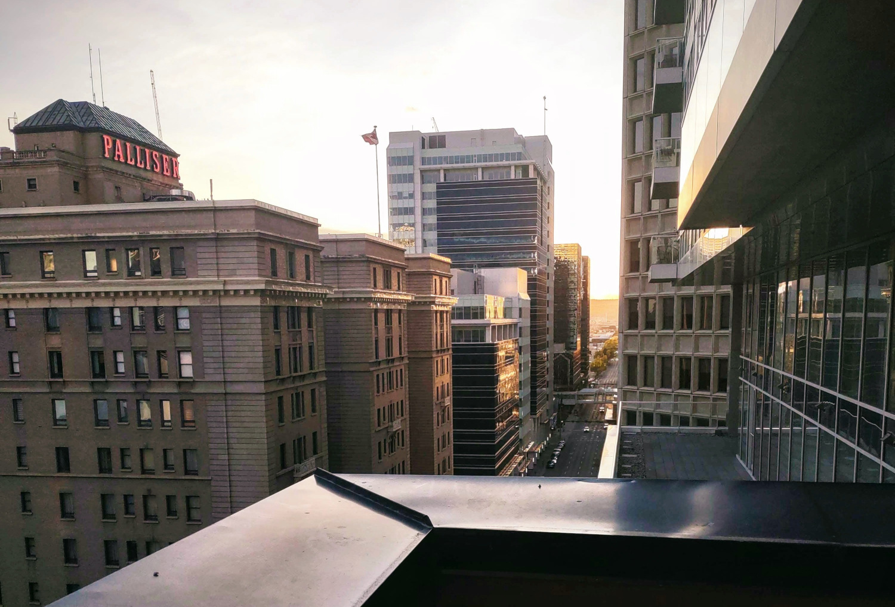

If you’ve ever worked remotely, you’ve likely felt the pressure to turn your camera on when you didn’t want to. It’s a common occurrence. Maybe you stayed out a little too late on Sunday night, had a bit too much tequila, and didn’t get to sleep until 3 AM. You wake up after snoozing your alarm four times, realizing, “Oh no, it’s 8:50 AM., and I have a meeting with the offshore team in 10 minutes.” Your hair is a mess, and you have dark circles under your eyes. You don’t want to turn on your camera, but you do anyways because your manager is pushing for more team engagement.

Now, imagine feeling that pressure every single day, not because of a late night out, but because your very identity is under scrutiny. For transgender individuals, the struggle with "cameras on" policies isn’t just about looking presentable; it’s about navigating feelings of dysphoria, anxiety, and the constant challenge of being visible in a way that feels safe and affirming.  Sometimes these well-intentioned policies can be harmful.  Embracing flexibility can unlock the full potential of a diverse team.

Besides, don’t you feel that cameras on meetings are overused?  Shouldn’t we be looking for more creative  and effective solutions for employee engagement and synergy in our ever changing world? The overuse of this meeting type is not just hurting diversity, equity, inclusion and belonging efforts, but is also not that effective in generating employee engagement.

## The Problem with “Cameras On” Meetings

Although remote work has generally been very positive for diverse workplaces, there are many areas for improvement.  In a remote work environment, managers contend with retaining employee engagement and promoting collaboration.  Cameras on meetings to the rescue! It’s just as good as meeting in the office right?

Well… if you have worked on a remote team before, you know the answer to that question.  Cameras on meetings are definitely **much** less effective.  In fact, it can often work against a lot of the benefits that remote work can provide.  

Remote work has benefited gender minorities within the industry greatly, allowing more people to participate in work than before.  Women have benefited a lot: not having to choose between their career or parenthood, and freeing themselves from the constrains of societal norms and beauty standards.  It’s an unfortunate truth that many people use a woman’s appearance to inform themselves about their professionalism and competence. 

For transgender women, these struggles are often heightened as it is not just their professional ability being judged, but also their validity as women. This added layer of pressure can exacerbate feelings of inadequacy and anxiety. Transgender women might feel an intense pressure to conform to stereotypical feminine beauty standards to be taken seriously in their professional roles.

Unfortunately, having mandatory cameras on meetings, undoes a lot of the benefits that a remote work environment is purported to provide.

## Emotional and Financial Burden

The effort to meet societal beauty standards can take a toll emotionally and financially. Transgender women might invest significant time and resources into their appearance to gain professional acceptance. I felt this very personally, and it was one of the main driving forces for me to seek facial feminization surgery. This surgery costs around $30,000 on the low end, to upwards of $100,000. This is just one example of the additional burden transgender women feel within professional life. Women, in general, also have recurring costs in cosmetic products, which are not cheap either. All this effort is just to avoid the unspoken discrimination that happens every day in workplaces, as shown by recent articles about women being denied job opportunities simply because they didn’t wear makeup that day.

The financial struggle only adds to the heaps of emotional and mental challenges faced by transgender individuals from gender dysphoria.

I can speak first hand to the pain and suffering that dysphoria can cause.  This feeling of incongruence between our inner selves, and our physical selves can often manifest very physically.  It’s not just a mental struggle.  Some days it’s worse than others, and when those days align with having a mandatory “camera’s on” meeting, all these feelings are only exacerbated and may lead me to take a sick day off work.

All it takes is a flexibility from this requirement, and it would allow me to turn a sick day, into a productive one.  Flexibility also eases the burden all women feel not just mentally, but on their bank account as well.

## But what about employee engagement, community, and collaboration?

While "cameras on" meetings have become a standard solution for fostering employee engagement in remote work environments, they are often overused and lack the creativity needed to truly enhance team dynamics. The mandate to always be on camera can create stress and discomfort, detracting from the intended goal. A scheduled cameras on meeting, is not the same as a meeting in the office.  In the office, collaboration and engagement often occurs naturally rather than in scheduled meetings.  Trying to replicate the office in a distributed work environment is never going to work.  Remote work offers a new set of challenges, but also new benefits and should be considered differently compared to co-located ones.

Implementing fun activities like web based games like, skribl.io, and gartic phone can help break the ice and foster camaraderie without the need for cameras.  Hosting virtual social hours or coffee breaks can provide a relaxing setting for team members to connect and build relationships. 

There is a plethora of technology out there that aids in asynchronous communication.  Utilizing platforms like Slack, Discord, Microsoft Teams, or forum boards can give teams a good way to socialize and connect despite not being in a meeting at the same time.  I loved seeing the travel pictures from my offshore team members in India, and I loved sharing my pictures from my trips too!  Things like this allow us to engage in socialization on our own time, a big win for not just gender diverse individuals, but all introverted nerds who work in the tech industry (most of us).

One company I worked for had many employees across the globe, but mostly in small pockets in certain cities.  We would organize meetups between co-located employees to go on walks, dine, bowl, and plenty of other social activities.  These social activities which only happened once every few months were much more effective in fostering relationships and synergy than any amount of cameras on meetings could.

## TL;DR

Mandatory "cameras on" meetings can be harmful for gender diverse individuals, triggering gender dysphoria and increasing anxiety. Women, especially transgender women, face heightened scrutiny and pressure to conform to beauty standards, which can be emotionally and financially taxing. Instead of relying on "cameras on" policies, employers should explore creative and inclusive strategies for employee engagement. These include virtual icebreakers, collaborative tools, and flexible communication channels. These approaches foster a more supportive and productive remote work environment for all employees.