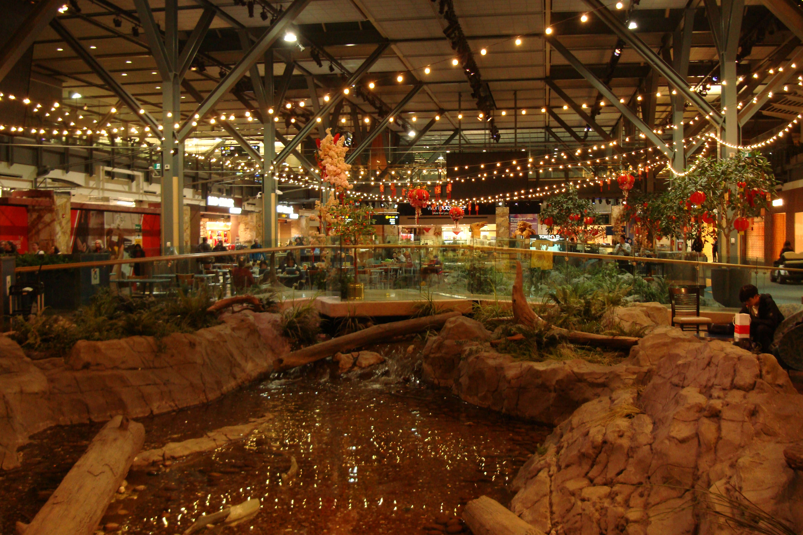
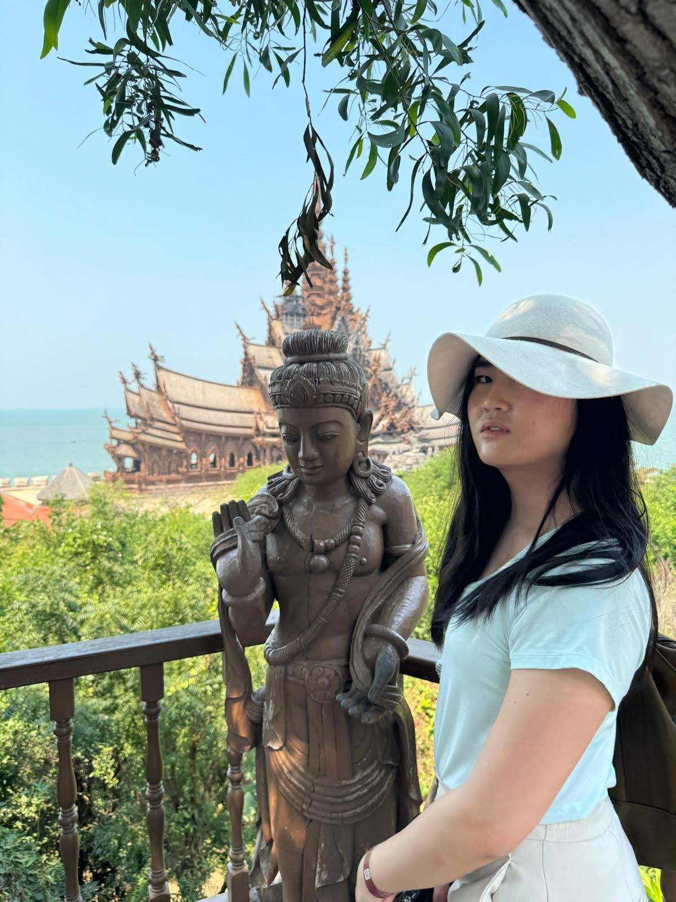

The view from my window is an unfamiliar one. Where once my gaze would meet the comforting sight of a backyard adorned with a brick fire pit and a sprawling garden with fresh vegetables, now, it is of a lively, sprawling, bustling city. Three or four lanes of traffic intersect in a dance of perpetual movement, while a chaotic tapestry of electrical, internet, and telephone wires forms a web above the streets, a stark contrast to the organized simplicity of my usual surroundings. And oh, the warmth! A temperature that stands about 50 degrees higher than the familiar chill of Calgary, Alberta. Here, in the heart of Bangkok, Thailand, this is the everyday scene.

This change of scenery is not just geographical for me, it's also symbolic. It mirrors the transformative journey I find myself on, seeking medical aid for my gender dysphoria. Bangkok, with its vibrant energy and diverse culture, offers an interesting backdrop for my own personal evolution.

## How Did I Get Here?

Well, I flew from Calgary, to Vancouver, to 台北 Taiwan, then to Bangkok Thailand.  But I would be making a horrible mischaracterization if I suggested this journey was as easy as booking a flight.  This is only the culmination of the real journey, the one of through the rivers of identity and self discovery, which was a much more treacherous trek.

My journey began with a recognition, an acknowledgement that this sense of deep disharmony between my physical form and my inner self was not just valid, but demanded attention.  Every moment of my waking life felt like navigating the the Evergrande through the Suez canal.  It felt increasingly difficult to navigate through the waters of my life, and I knew that without intervention and change, I would end up washed up ashore in a place I dared not imagine.

It took a lot of introspection and courage, but I was finally able to start hormone therapy during my first year of university.  Those first few months on hormone therapy were unimaginably difficult for me.  Even though I had managed to navigate through the first treacherous canal, what awaited me was a were more hardships than I had imagined.  The first few months felt like traversing stormy seas, each wave carrying its own set of emotional and physical challenges. Hormone therapy, while a beacon of hope, demanded resilience beyond what I had ever known. It wasn't just a shift in my body; it was a profound transformation of my entire being.

Physically, the changes were gradual but relentless. Emotionally, it was a tumultuous voyage through unexplored feelings and reactions.  Support from my friends proved vital during this time.  One memorable story stands out, a moment of unexpected laughter interrupting a deep sadness.

There was a day when the weight of my emotions felt insurmountable, and I found myself engulfed in extreme sadness. It seemed like nothing could make me feel better.  That’s when one of my friends stepped in with a solution: a pizza from Pizza Pizza with anchovies.

Now, if you haven't experienced Pizza Pizza with anchovies, let me tell you… it's an acquired taste at best, and one that didn't align with my palate. The less-than-appetizing choice was what brought me out of my sadness.  I could not stop laughing at how bad it tasted, and my friend laughed with me.  I always find the time to think back and feel grateful for my friends during this time.

I’ve come a long way.  Even though though I struggled, I tried my best to use it as an opportunity to grow stronger.  I learned how to introspect, how to deal with roadblocks in a healthy way, and how to live life they way I want to live.  These experiences shaped my values and introduced some new ideas in my life, through an unexpected source.

## Seeking Comfort Through Spirituality

I was never a spiritual or religious person.  I was very sheltered from the influences of religion despite growing up in Canada.  However, in the midst of my transformative journey I found guidance from Daoist literature.  One aspect of this ancient philosophy, encourages us to understand society as a construct and to negotiate how we live our lives within it to seek simplicity and the path of least resistance.

### Wu Wei in Social Negotiation

The Daoist principle of wu wei, or non-action, suggests aligning oneself with the natural course of events rather than forcing your way through to your goal and ignoring the will of nature.  In the context of societal constructs, this does not imply passivity, but rather emphasizes navigating societal expectations with adaptability and flexibility.  The easiest way to reach the goal, is to find the path of least resistance.  This means that we need to let go of our ego, and to be adaptable in our approach to life.  If we grasp for things, we will lose them.  Instead, we must align our will with the will of nature, allowing us to reach our destination with much less effort.

Through my transition, I was constantly stuck grasping to the things I wished for.  I wanted to be hot and sexy, I wanted to be beloved and popular, I wanted to be feminine and elegant.  These are all big goals that seemed out of reach, so I grasped for these things in unhealthy ways.

I constantly took filtered pictures and posted them online for attention.  Yet when I turned off my phone and looked in my mirror I was still the same as I was before.  I sought attention from those around me, and I used the attention that they gave me as proof of my popularity.  Yet when I was alone at home, I felt incredibly lonely.  For femininity and elegance, there was no helping me there.  I just used the first two coping mechanisms to repress this desire.

I grasped for the things I didn’t have and never came closer to having them.  So I started taking life at a much slower pace.  I was okay knowing that I did not have those things that I wished for, but I took small steps each day to move towards that.  I let the hormones do their work, focused on my education, and when the computer science assignments were too much, I took breaks to practice my makeup application.  I went out to shop for clothes, starting with simple and flexible pieces that were more feminine.  Before I knew it, I had become much more feminine and elegant, not just in my outward appearance, but also in my approach towards life. 

Needless to say, Daoist spirituality has helped me greatly in my journey.  In a world filled with egotism and superficiality, letting go of these things has been the key to unlock my growth both as a person and as a woman.

## Gratitude

As I become more privileged, I want to remain grateful.  Many transgender women struggle to afford and seek out medical care.  I was once in that position where flying abroad to seek surgery was an impossible ask.  Now that I am actually here and hours away from my surgical procedures, I can’t help but feel like this is surreal.  For this opportunity I will be eternally grateful. 

Sitting by this unfamiliar window, I find solace in change's promise of growth and self-acceptance. Though anxious, I'm no longer scared of change; I'm eager and excited. As Bangkok embraces me with chaotic beauty, I carry the lessons of my past struggles.  The operating room awaits, promising a physical transformation to align with my inner self.

Regards from Bangkok, Thailand.  I’ll see you on the other side!

\- River Wang