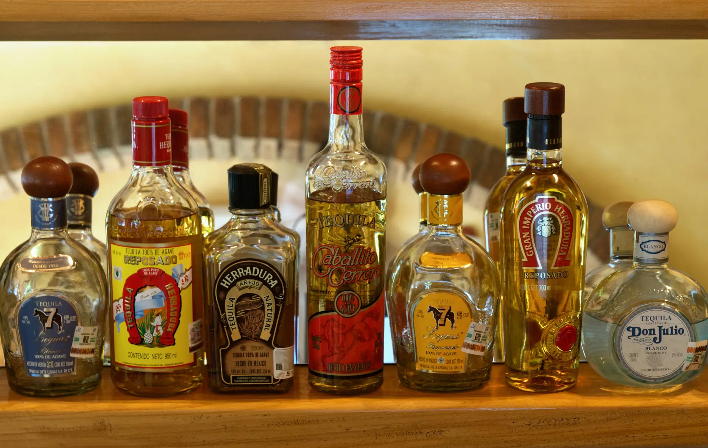
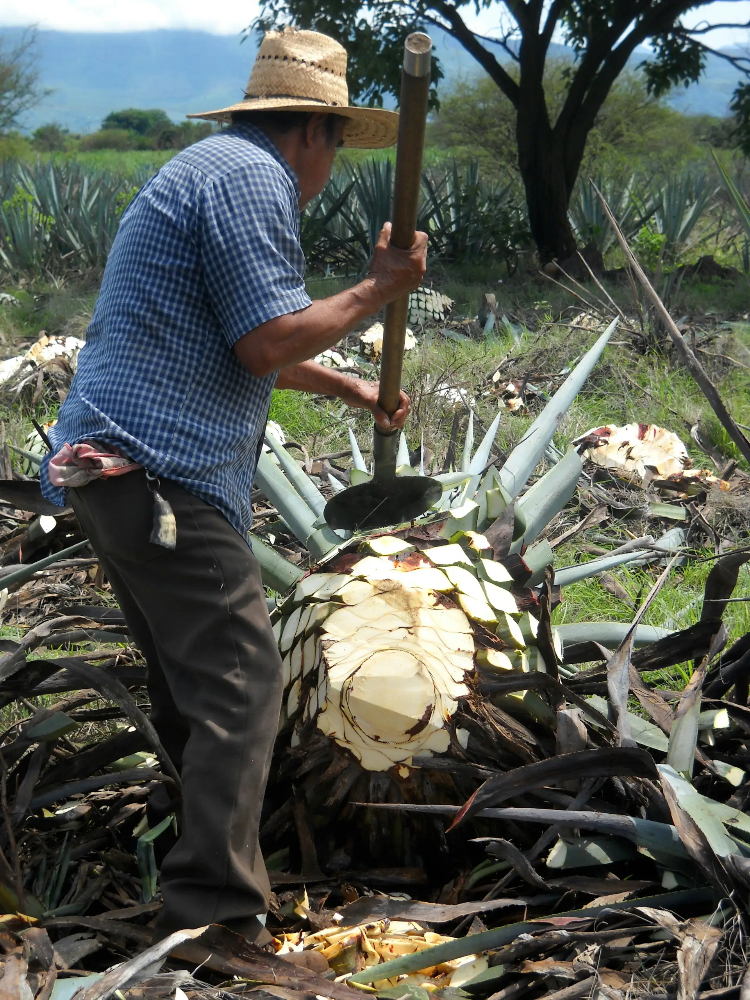
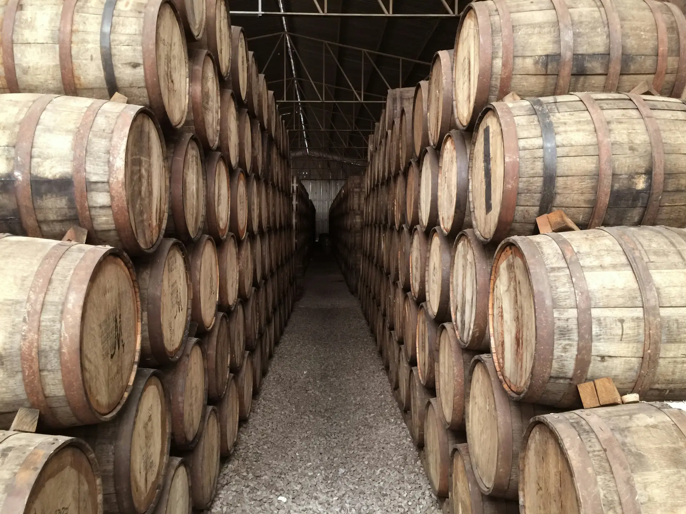
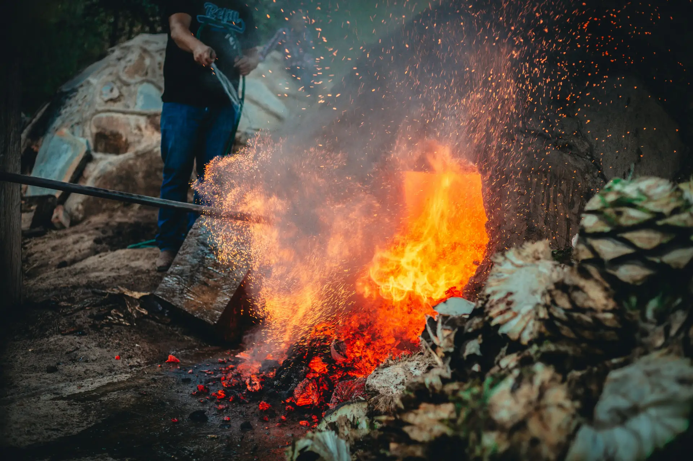

Well, here we are.  Boycotting American products eh?  If you drink a lot of American liquor, it might feel a little bitter (with an alcoholic aftertaste) to be losing something you have enjoyed for a long time.  Why not try tequila?  Tequila is an often misunderstood drink don’t you know?  It’s seen as a party drink that is meant to lubricate you for socialization as quickly as possible, or to be mixed away into a fruity drink.  Although there’s no wrong way to enjoy this great drink, many tequila enthusiasts prefer to enjoy tequila by sipping slowly and appreciating the finer details—as you would with a fine wine.  If you choose the right bottles, you might even find the same tones and flavours you are already familiar with in American liquor such as: Bourbon, or Tennessee whisky.

## Basics
Tequila comes from the Tequila region in Jalisco Mexico.  It comes from the agave plant, which looks like a huge overgrown pineapple:

The long process of growing and tending agave plants kicks off the production of tequila.  It can take up to 7 years for agave to reach maturity.  After they are harvested, the **aging**, **cooking**, and **distillation** processes produce the drink we are interested in: Tequila!  Differences in these processes are what make every bottle of tequila unique.  

## The Classifications
There are many different classifications of tequila that describe the length of time it has been aged: **Blanco**, **Reposado**, **Añejo**, and **Extra Añejo**.
1. **Blanco**:
    - Unaged or rested for less than 60 days
    - Clear
    - Crisper tastes with more raw flavours
    - Great for mixing and if you love sharper tastes
2. **Reposado**
    - Aged between 2 and 12 months
    - Light golden hue
    - Hints of flavour from the barrels in which there were aged
    - Great for shots, mixing, and sipping
3. **Añejo**
    - Aged for between 1-3 years
    - Richer colour
    - More complex tastes
    - Meant for sipping neat and appreciating finer flavour tones
4. **Extra Añejo**
    - Aged for 3+ years
    - Much deeper colour similar to Bourbon or whisky
    - Often special distillations with much river and complex tastes
    - Sometimes made in smaller batches with a more artisanal approach

I usually like to keep a Reposado around, for my nights in with my partner, or just to enjoy with a fancy meal.  It's a great balance between economy, and more complex tastes!  One of my favourite bottles of Tequila, is the Mi Campo Reposado, which you can find here: [Tequila Matchmaker](https://www.tequilamatchmaker.com/agave_spirits/6446-tequila-mi-campo-reposado)

The site I linked, is "Tequila Matchmaker", one of my favourite sites to find information about different bottles of Tequila.  I highly recommend you use it when considering what bottle you want to buy.  I found that the Mi Campo Reposado, is that it is aged in wine barrels from this site—which I wouldn't have known otherwise.  As you may know, the nature of the barrel which it is aged within can have a significant impact on the Tequila's final taste.

## It's All About Aging
Tequila is aged in oak barrels.  It is the tastes of the barrel that is infused with the tequila as it is aged.  In fact, many batches of tequila are often aged in American Bourbon barrels—like ones used to produce Jack Daniels.  So if you are a fan of American liquor, you might want to consider tequila aged in barrels used for your favourite drinks!

The differences in each barrel makes the taste of every bottle of Tequila unique:
- **Type of Oak**: Usually, either European oak, or American oak is used for Tequila barrels.  The type of oak used can infuse different flavours into the final product.  European oak is generally more delicate, spicy and fruity, whereas American oak can impart more vanilla and caramel tones.
- **Char level** (or toast): The inside of the barrel is put to the flame, with a “charring” infusing more smokiness into the final product due to the intensity of the flame.  Whereas “toasting” can contribute more subtle spice, depending on the type of oak.
- **Previous contents**: Most batches of tequila use barrels previously used for Bourbon, and whisky, since they can only be used once, they are often sold at a discount to Tequila distilleries for reuse.  These Bourbon and whisky barrels often leave subtle vanilla, or caramel tones. Many producers get creative with their barrel choices, and may use other types of barrels for different flavours—like wine barrels, which can infuse a more fruity, sweet taste!

The aging process itself can influence the final taste of the tequila in so many different ways.  If you’re a fan of American liquor, Tequila can be a great way to find those same vanilla, caramel flavours, but transformed, or offer you a world of exploration.

## Cooking the Agave
After the agave is harvested, they must be cooked to convert its starches into fermentable sugars.  This process can have a HUGE impact in the final flavour, and texture of the Tequila.  Some are sought after for being traditional and artisanal, and others are avoided due to their industrial nature.

### Smoke Pit

This is the most traditional way to cook agave.  A large smoke pit is dug in the ground where the agaves are piled with charcoals.  This process takes multiple days to complete.  It infuses the best smoky flavours out there.  However, it is not a popular method of cooking agaves for Tequila since it’s so slow.  You will have to look harder if you’re looking for this, or branch out to Mezcal (a type of distilled drink of which Tequila is a subset).  

### Stone Oven

This is the traditional way to cook agave for tequila.  The agave are piled into a large brick oven, which is then heated for 24-48 hours to slowly release the agave sugars.  This results in a sweet, caramelized, roasted flavour tones, and retains much of the agave’s natural characteristics.  This is a really popular method for more premium batches of Tequila.

### Autoclave

Here comes industrialization!  Autoclaves for the agave cooking process are these huge cylindrical cookers that utilize pressure to cook.  These don’t infuse any smoky flavour that is associated with more traditional Tequila, but it is also the most common method for producing Tequila nowadays.  It’s just too damn efficient.  It takes less than half a day to cook agave this way!

### Diffuser

More industrialization is the answer to everything right?  Diffusers are an even more industrial process, much further removed from even the Autoclave.  These are huge machines that extract the agave sugars through high pressure water blasts, and often times acid plus enzyme mixtures that extract the sugars from the agave fibres without any cooking!

It’s up to you to choose between these processes.  However, you may want to avoid diffusers since they are often criticized for over-industrialization and producing unnatural flavours compared to more traditional methods.  If you’re looking for affordable options, you will most likely be choosing agave cooked through the autoclave method.  Otherwise, if you’re looking for that one “special” bottle, you will want to look for brick oven and smoke pit options.

## Distill, Distill, Distill
The distillation process is the last element of Tequila-making that will be covered in this article.  It’s usually not the main focus compared to the agave cooking method, and the aging process.  However, it is often considered by enthusiasts since it’s an important transformation. 

The agave juice is usually double, or triple distilled before it becomes Tequila.  Distillation is the process of refining the agave juice to produce a more concentrated drink, and removing it of impurities.  You don’t need to know all the details about the process, but there are a few tools that are used in this process that can change how tequila tastes.

### Copper Pot
Traditionally, most tequila was distilled in copper pots.  The copper reacts with sulphur compounds within the Tequila—removing them—leading to a richer and smoother flavour.  However, these are more expensive to maintain as they require much more careful and frequent cleaning.

### Stainless Steel Pot
The modern alternative is the stainless steel pot.  Stainless steel pots requires less frequent cleaning, making it a more economical and popular option.  This doesn’t react with the sulphur compounds in the same way, but can produce a cleaner taste.  However not all stainless steel pots are made the same!  Some contain copper elements inside in order to retain some of the benefits from the traditional method.

### Distillation Column
If you come from the Alberta oil industry like me, you might recognize the use of a column in the oil refinement process.  The same theory applies here!  The compounds within the agave mixture are separated as the steam moves through the column and cools.  The higher boiling point compounds condense first and are separated.   This is the most modern method of distillation, and unlike with copper or steel pots that need to be run batch by batch, the distillation column can be theoretically run 24/7.  However, that means the distiller has to sacrifice the finer control offered by more traditional methods.

## Conclusion
Well, now you know a lot about tequila.  Believe it or not, what I highlight in this article is just the tip of the iceberg.  You could write an essay about the intricacies and edge cases for each subsection that I wrote about.  It’s ultimately up to you how deeply you want to go down this rabbit hole.  My hope is that you might be more comfortable picking up a bottle of Tequila instead of a bottle of American liquor.

Thanks for reading and good luck on your Tequila journey eh?